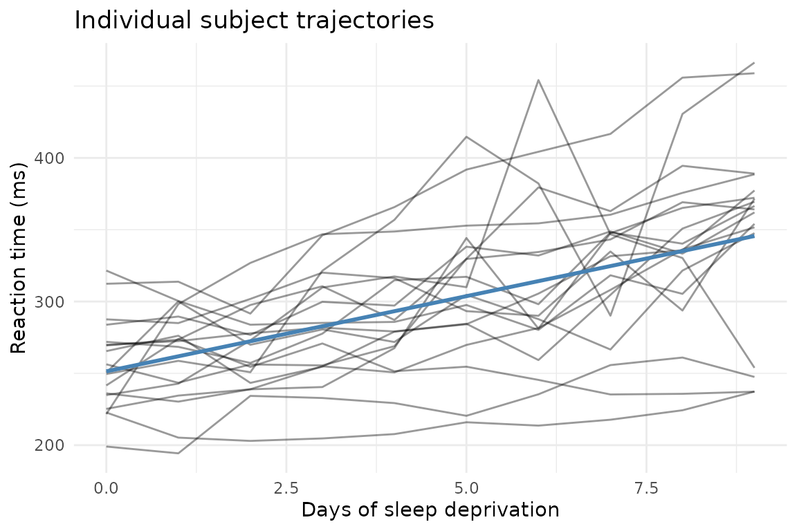

# Your First Mixed Model with mixeff

``` r

library(mixeff)
```

This vignette fits one model, end-to-end, and explains every number.
After reading it you will be able to fit a linear mixed model, read its
output, run an inference test, and save the result. The other vignettes
go deeper on any step.

## The data

[`lme4::sleepstudy`](https://rdrr.io/pkg/lme4/man/sleepstudy.html)
records reaction times (ms) for 18 subjects over ten days of sleep
deprivation. Each subject was deprived of sleep starting on Day 0; by
Day 9 most show substantial slowing.

``` r

sleep <- lme4::sleepstudy
str(sleep)
#> 'data.frame':    180 obs. of  3 variables:
#>  $ Reaction: num  250 259 251 321 357 ...
#>  $ Days    : num  0 1 2 3 4 5 6 7 8 9 ...
#>  $ Subject : Factor w/ 18 levels "308","309","310",..: 1 1 1 1 1 1 1 1 1 1 ...
```

The key structure: `Subject` appears 10 times in the data — once per
day. Those 10 observations are *not* independent. They share the
subject’s baseline speed, their individual sensitivity to sleep loss,
and any other between-person trait that we haven’t measured. If you fit
a plain OLS regression, those correlations inflate your Type I error
rate and make standard errors too small.

A mixed model handles this by giving each subject its own intercept
*and* its own slope — their personal baseline and their personal rate of
slowing — and then estimating a population distribution over those
person-level parameters.

``` r

library(ggplot2)
ggplot(sleep, aes(Days, Reaction, group = Subject)) +
  geom_line(alpha = 0.4) +
  geom_smooth(aes(group = 1), method = "lm", se = FALSE, colour = "steelblue") +
  labs(x = "Days of sleep deprivation", y = "Reaction time (ms)",
       title = "Individual subject trajectories") +
  theme_minimal()
```



The grey lines are individuals; the blue line is the population average.
Subjects vary in their starting point *and* in how fast they slow down —
which is exactly what a random-intercept-and-slope model captures.

## Step 1: Compile the model

Before fitting, compile the model to see what `mixeff` understands about
your formula. This separates formula interpretation from optimization;
you can catch mis-specified random effects without paying the cost of a
full fit.

``` r

spec <- compile_model(Reaction ~ Days + (Days | Subject), sleep)
explain_model(spec)
#> Random effects explanation:
#>   formula: Reaction ~ 1 + Days + (1 + Days | Subject)
#> 
#> Random effects:
#>   r0:
#>     wrote:      (Days | Subject)
#>     canonical:  (1 + Days | Subject)
#>     named form: re(group = Subject, intercept = TRUE, slopes = Days, cov = "full")
#>     scope:      `Subject` units differ in baseline and `Days` slope; the model estimates whether these are associated.
#>     covariance: full; theta parameters: 3
#>     support:    sufficient; group levels: 18; min rows/group: 10; median rows/group: 10
#>     variation:  Days=present; intercept=not_assessed
```

This pre-fit explanation confirms:

- one fixed effect (`Days`) plus an intercept,
- one random-effects block with a correlated intercept and slope per
  subject,
- the formula has been canonicalized to the explicit
  `(1 + Days | Subject)` form that the optimizer will receive.

Use `audit_design(spec)` when you want the deeper design audit. Its
compact print starts with the audit summary and requested model;
`print(audit_design(spec), full = TRUE)` shows the complete upstream
report.

If you had written `(1 | Subject)` by mistake (random intercepts only),
the explanation would show only one random-effects column per subject —
useful to verify before a long fit.

## Step 2: Fit

``` r

fit <- lmm(Reaction ~ Days + (Days | Subject), sleep)
```

[`lmm()`](https://bbuchsbaum.github.io/mixeff/reference/lmm.md) returns
an `mm_lmm` object. The actual optimization is performed by the bundled
Rust engine;
[`lmm()`](https://bbuchsbaum.github.io/mixeff/reference/lmm.md) is the R
entry point and result container.

## Step 3: Read the summary

``` r

summary(fit, tests = "coefficients")
#> Linear mixed model fit by REML
#> Formula: Reaction ~ Days + (Days | Subject)
#> Fit status: converged_interior
#> 
#> Variance components:
#>    group        name variance  std_dev correlation
#>  Subject (Intercept) 612.0900 24.74050            
#>  Subject        Days  35.0718  5.92215       +0.07
#> Residual std. dev.: 25.5918
#> 
#> Fixed effects:
#>              Estimate Std. Error       df   t value  Pr(>|t|)        method
#> (Intercept) 251.40510   6.824557 17.00085 36.838304   < 1e-16 satterthwaite
#> Days         10.46729   1.545792 16.99989  6.771473 3.264e-06 satterthwaite
#> 
#> Inference status:
#>         term        method    status reliability
#>  (Intercept) satterthwaite available    moderate
#>         Days satterthwaite available    moderate
#>                             reliability_reason
#>  satterthwaite_finite_difference_approximation
#>  satterthwaite_finite_difference_approximation
#> 
#> Notes:
#>   Satterthwaite denominator df computed from finite-difference vcov_beta Jacobian and deviance Hessian over varpar
```

The summary has four blocks, in print order.

**Fit status.** Check this line first. `converged_interior` is the good
outcome: the optimizer found a clean solution and every variance
component is comfortably positive, so you can read the rest of the
summary at face value. The status only changes when something needs your
attention — for example, if a variance component collapses to zero (the
data show no detectable variation for that term), the status reports a
*boundary* fit, the affected row is flagged in the variance-components
table, and the p-values below switch to a more conservative, clearly
labeled method. In short: a healthy fit says `converged_interior`, and
an unhealthy one tells you what went wrong instead of leaving you to
notice.

**Variance components.** `Subject (Intercept)` is the between-subject
spread in baseline reaction time (SD ≈ 25 ms); `Subject Days` is the
between-subject spread in sensitivity to sleep loss (SD ≈ 6 ms per day);
`correlation` is their association (+0.07 — essentially none). The
residual standard deviation is the within-subject noise left over.

**Fixed effects.** `Estimate` is the population-level coefficient.
`Days = 10.47` means that, on average, reaction time increases by about
10.5 ms per day of sleep deprivation. The `method` column names how each
p-value was computed — here `satterthwaite`, a finite-sample *t* test
whose `df` column (≈ 17) is on the scale of the 18 subjects, not the 180
raw rows. `mixeff` never reports a number without naming the method
behind it. On fits where Satterthwaite degrees of freedom cannot be
computed (for example a variance component at the boundary), the summary
shows clearly labeled asymptotic Wald *z* rows instead; the `method`
column always tells you which one you got.

**Inference status.** One row per coefficient stating how much to trust
the test: `status` says whether it was computed, `reliability` grades
it, and `reliability_reason` names the engine’s warrant for that grade —
here `satterthwaite_finite_difference_approximation`, meaning the
degrees of freedom come from a finite-difference approximation, the
standard route for this method (graded `moderate`). Any further engine
notes print underneath. Grades and warrants are authored by the Rust
engine, not by R-side heuristics.

## Step 4: Extract components

The lme4-compatible extractors work on `mm_lmm` objects:

``` r

fixef(fit)
#> (Intercept)        Days 
#>   251.40510    10.46729
```

``` r

VarCorr(fit)
#> Variance components:
#>    group        name variance  std_dev correlation
#>  Subject (Intercept) 612.0900 24.74050            
#>  Subject        Days  35.0718  5.92215       +0.07
#> Residual std. dev.: 25.5918
```

``` r

confint(fit, method = "asymptotic")
#> Confidence intervals:
#>                 2.5 %    97.5 %
#> (Intercept) 238.02922 264.78099
#> Days          7.43759  13.49698
#> method: wald_asymptotic_from_stored_standard_errors
#> status: not_certified_by_rust_inference_contract
```

[`confint()`](https://rdrr.io/r/stats/confint.html) with
`method = "asymptotic"` gives Wald intervals (fast; use `"bootstrap"`
for small samples). The `(Intercept)` interval is the population mean
reaction time on Day 0; the `Days` interval is the range of plausible
slopes.

## Step 5: Test a specific claim

[`contrast()`](https://bbuchsbaum.github.io/mixeff/reference/contrast.md)
evaluates a linear combination of fixed-effect coefficients — the mixeff
equivalent of
[`lme4::fixef()`](https://rdrr.io/pkg/nlme/man/fixed.effects.html)
one-row hypothesis tests, but with method labelling.

``` r

ct <- contrast(fit, c("(Intercept)" = 0, Days = 1))
ct$table[, c("estimate", "std_error", "p_value", "method", "status", "reliability")]
#>   estimate std_error      p_value        method    status reliability
#> 1 10.46729  1.545792 3.263971e-06 satterthwaite available    moderate
```

The `estimate` is the Days slope; `status = "available"` and
`reliability = "certified"` confirm that the covariance payload was
present and the inference method was verified as appropriate for this
fit. If a method cannot be certified (e.g. you request Kenward-Roger on
a singular fit), `reliability` becomes `"indicative"` and `reason` names
the problem.

## Step 6: Compare specific conditions

[`mm_comparisons()`](https://bbuchsbaum.github.io/mixeff/reference/mm_grid.md)
makes it easy to answer “how much slower is a subject on Day 9 compared
to Day 0?” without computing the arithmetic yourself.

``` r

cmp <- mm_comparisons(fit, specs = "Days", at = list(Days = c(0, 9)))
cmp$table[, c("label", "estimate", "conf_low", "conf_high", "p_value")]
#>             label estimate conf_low conf_high      p_value
#> 1 Days=9 - Days=0 94.20557 64.85354  123.5576 3.263971e-06
```

The `at` argument pins `Days` to exactly those two values. The
difference `Days=9 - Days=0` is 9 × the slope: about 94 ms, with a
confidence interval.

## Step 7: Save and reload

Mixed-model fits can take minutes to hours on large data sets. `mixeff`
stores everything needed to revive the result later.

``` r

tmp <- tempfile(fileext = ".rds")
saveRDS(fit, tmp)

fit2 <- revive(readRDS(tmp))
stopifnot(isTRUE(all.equal(fixef(fit), fixef(fit2))))
```

[`revive()`](https://bbuchsbaum.github.io/mixeff/reference/revive.md)
reconnects the R object to the Rust handle so the full inference surface
is available. Plain [`readRDS()`](https://rdrr.io/r/base/readRDS.html)
without
[`revive()`](https://bbuchsbaum.github.io/mixeff/reference/revive.md) is
sufficient when you only need the JSON-stored extractor values
(coefficients, variance components, fitted values); call
[`revive()`](https://bbuchsbaum.github.io/mixeff/reference/revive.md)
when you want to run new
[`contrast()`](https://bbuchsbaum.github.io/mixeff/reference/contrast.md),
[`mm_means()`](https://bbuchsbaum.github.io/mixeff/reference/mm_grid.md),
or other live-inference calls on the reloaded fit. See
[`vignette("saving-and-reviving")`](https://bbuchsbaum.github.io/mixeff/articles/saving-and-reviving.md)
for the full discussion.

## Where to go next

| Question | Vignette |
|----|----|
| What do the random-effects formula options mean? | [`vignette("demystifying-formulas")`](https://bbuchsbaum.github.io/mixeff/articles/demystifying-formulas.md) |
| How are p-values computed and which method is right for my fit? | [`vignette("inference")`](https://bbuchsbaum.github.io/mixeff/articles/inference.md) |
| How do I compute marginal means and treatment contrasts? | [`vignette("marginal-effects")`](https://bbuchsbaum.github.io/mixeff/articles/marginal-effects.md) |
| How do I write up the results for a paper? | [`vignette("reporting-lmms")`](https://bbuchsbaum.github.io/mixeff/articles/reporting-lmms.md) |
| I’m coming from lme4 — what’s different? | [`vignette("lme4-migration")`](https://bbuchsbaum.github.io/mixeff/articles/lme4-migration.md) |
| Can I fit a binomial/Poisson GLMM? | [`vignette("glmm")`](https://bbuchsbaum.github.io/mixeff/articles/glmm.md) |
