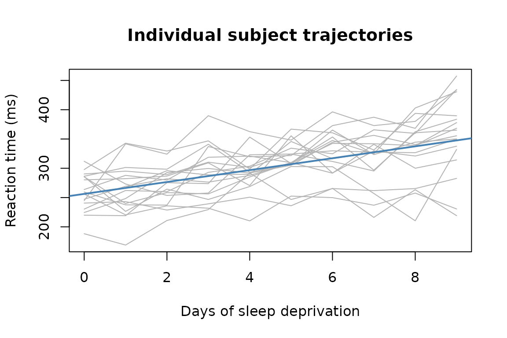

# Your First Mixed Model with mixeff

``` r

library(mixeff)
```

This vignette fits one model, end-to-end, and explains every number.
After reading it you will be able to fit a linear mixed model, read its
output, run an inference test, and save the result. The other vignettes
go deeper on any step.

## The data

The example simulates reaction times (ms) for 18 subjects over ten days
of sleep deprivation. Each subject has a different baseline and a
different response to continued sleep loss. The data are generated
inside this vignette, so the tutorial runs without an example-data
package.

``` r

str(sleep)
#> 'data.frame':    180 obs. of  3 variables:
#>  $ Days    : int  0 1 2 3 4 5 6 7 8 9 ...
#>  $ Subject : Factor w/ 18 levels "1","2","3","4",..: 1 1 1 1 1 1 1 1 1 1 ...
#>  $ Reaction: num  224 248 293 300 292 ...
#>  - attr(*, "out.attrs")=List of 2
#>   ..$ dim     : Named int [1:2] 10 18
#>   .. ..- attr(*, "names")= chr [1:2] "Days" "Subject"
#>   ..$ dimnames:List of 2
#>   .. ..$ Days   : chr [1:10] "Days=0" "Days=1" "Days=2" "Days=3" ...
#>   .. ..$ Subject: chr [1:18] "Subject=1" "Subject=2" "Subject=3" "Subject=4" ...
```

The key structure: `Subject` appears 10 times in the data — once per
day. Those 10 observations are *not* independent. They share the
subject’s baseline speed, their individual sensitivity to sleep loss,
and any other between-person trait that we haven’t measured. If you fit
a plain OLS regression, those correlations inflate your Type I error
rate and make standard errors too small.

A mixed model handles this by giving each subject its own intercept
*and* its own slope — their personal baseline and their personal rate of
slowing — and then estimating a population distribution over those
person-level parameters.



The grey lines are individuals; the blue line is the population average.
Subjects vary in their starting point *and* in how fast they slow down —
which is exactly what a random-intercept-and-slope model captures.

## Step 1: Compile the model

Before fitting, compile the model to see what `mixeff` understands about
your formula. This separates formula interpretation from optimization;
you can catch mis-specified random effects without paying the cost of a
full fit.

``` r

spec <- compile_model(Reaction ~ Days + (Days | Subject), sleep)
explain_model(spec)
#> Random effects explanation:
#>   formula: Reaction ~ 1 + Days + (1 + Days | Subject)
#> 
#> Random effects:
#>   r0:
#>     wrote:      (Days | Subject)
#>     canonical:  (1 + Days | Subject)
#>     named form: re(group = Subject, intercept = TRUE, slopes = Days, cov = "full")
#>     scope:      `Subject` units differ in baseline and `Days` slope; the model estimates whether these are associated.
#>     covariance: full; theta parameters: 3
#>     support:    sufficient; group levels: 18; min rows/group: 10; median rows/group: 10
#>     variation:  Days=present; intercept=not_assessed
```

This pre-fit explanation confirms:

- one fixed effect (`Days`) plus an intercept,
- one random-effects block with a correlated intercept and slope per
  subject,
- the formula has been canonicalized to the explicit
  `(1 + Days | Subject)` form that the optimizer will receive.

Use `audit(spec)` when you want the deeper design audit. Its compact
print starts with the audit summary and requested model;
`print(audit(spec), full = TRUE)` shows the complete upstream report.

If you had written `(1 | Subject)` by mistake (random intercepts only),
the explanation would show only one random-effects column per subject —
useful to verify before a long fit.

## Step 2: Fit

``` r

fit <- lmm(Reaction ~ Days + (Days | Subject), sleep)
```

[`lmm()`](https://bbuchsbaum.github.io/mixeff/reference/lmm.md) returns
an `mm_lmm` object. The bundled Rust engine performs the optimization;
[`lmm()`](https://bbuchsbaum.github.io/mixeff/reference/lmm.md) is the R
entry point and result container.

## Step 3: Read the summary

``` r

summary(fit, tests = "coefficients")
#> Linear mixed model fit by REML
#> Formula: Reaction ~ Days + (Days | Subject)
#> Fit status: converged_interior
#> 
#> Variance components:
#>    group        name variance  std_dev correlation
#>  Subject (Intercept) 652.6850 25.54770            
#>  Subject        Days  29.5779  5.43856       -0.08
#> Residual std. dev.: 23.5051
#> 
#> Fixed effects:
#>              Estimate Std. Error       df   t value  Pr(>|t|)        method
#> (Intercept) 256.25687   6.845701 16.99932 37.433253   < 1e-16 satterthwaite
#> Days         10.15023   1.419601 16.99972  7.150056 1.626e-06 satterthwaite
#> 
#> Inference status:
#>         term        method    status reliability
#>  (Intercept) satterthwaite available    moderate
#>         Days satterthwaite available    moderate
#>                             reliability_reason
#>  satterthwaite_finite_difference_approximation
#>  satterthwaite_finite_difference_approximation
#> 
#> Notes:
#>   Satterthwaite denominator df computed from finite-difference vcov_beta Jacobian and deviance Hessian over varpar
```

The summary has four blocks, in print order.

**Fit status.** Check this line first. `converged_interior` is the good
outcome: the optimizer found a clean solution and every variance
component is comfortably positive, so you can read the rest of the
summary at face value. The status changes when something needs your
attention. If a variance component collapses to zero — the data show no
detectable variation for that term — the status reports a *boundary*
fit, and the affected row is flagged in the variance-components table.
The p-values below then switch from Satterthwaite *t* to asymptotic Wald
*z*, labeled as such and graded `low` reliability: the *z* test drops
the finite-sample correction, so treat its p-values as optimistic rather
than cautious.

**Variance components.** `Subject (Intercept)` is the estimated
between-subject spread in baseline reaction time; `Subject Days` is the
estimated between-subject spread in sensitivity to sleep loss;
`correlation` is their estimated association. The residual standard
deviation is the within-subject noise left over.

**Fixed effects.** `Estimate` is the population-level coefficient. The
`Days` estimate is the fitted average change in reaction time per day;
the simulation used a population slope of 10.5 ms per day. The `method`
column names how each p-value was computed — here `satterthwaite`, a
finite-sample *t* test whose `df` column is on the scale of the 18
subjects, not the 180 raw rows. Every test statistic and p-value in this
table names the method behind it. On fits where Satterthwaite degrees of
freedom cannot be computed (for example a variance component at the
boundary), the summary shows labeled asymptotic Wald *z* rows instead;
the `method` column tells you which one you got.

**Inference status.** One row per coefficient stating how much to trust
the test: `status` says whether it was computed, `reliability` grades
it, and `reliability_reason` names the engine’s reason for that grade —
here `satterthwaite_finite_difference_approximation`, meaning the
degrees of freedom come from a finite-difference approximation, the
standard route for this method (graded `moderate`). Any further engine
notes print underneath. The Rust engine assigns these grades and
reasons; the R side passes them through unchanged.

## Step 4: Extract components

The lme4-compatible extractors work on `mm_lmm` objects:

``` r

fixef(fit)
#> (Intercept)        Days 
#>   256.25687    10.15023
```

``` r

VarCorr(fit)
#> Variance components:
#>    group        name variance  std_dev correlation
#>  Subject (Intercept) 652.6850 25.54770            
#>  Subject        Days  29.5779  5.43856       -0.08
#> Residual std. dev.: 23.5051
```

``` r

confint(fit, method = "asymptotic")
#> Confidence intervals:
#>                 2.5 %    97.5 %
#> (Intercept) 242.83954 269.67420
#> Days          7.36786  12.93259
#> method: wald_asymptotic_from_stored_standard_errors
#> status: Wald (asymptotic) intervals from stored standard errors (engine-certified profile intervals: method = "profile")
```

[`confint()`](https://rdrr.io/r/stats/confint.html) with
`method = "asymptotic"` gives Wald intervals (fast; use `"bootstrap"`
for small samples). The `(Intercept)` interval is the population mean
reaction time on Day 0; the `Days` interval is the range of plausible
slopes.

## Step 5: Test a specific claim

[`contrast()`](https://bbuchsbaum.github.io/mixeff/reference/contrast.md)
tests a linear combination of fixed-effect coefficients and returns a
one-row table that names the method behind the p-value.

``` r

ct <- contrast(fit, c("(Intercept)" = 0, Days = 1))
ct$table[, c("estimate", "std_error", "p_value", "method", "status", "reliability")]
#>   estimate std_error     p_value        method    status reliability
#> 1 10.15023  1.419601 1.62626e-06 satterthwaite available    moderate
```

The `estimate` is the Days slope. `status = "available"` says the test
was computed; `reliability` grades it on a fixed scale — `high`,
`moderate`, `low`, or `not_available` — and here reads `moderate`, the
standard grade for finite-difference Satterthwaite. If you request a
method the fit cannot support (Satterthwaite on a boundary fit, say),
the row comes back with `status = "not_assessed"` and a `reason_code`
naming the problem instead of a number.

## Step 6: Compare specific conditions

[`mm_comparisons()`](https://bbuchsbaum.github.io/mixeff/reference/mm_grid.md)
answers questions like “how much does the population mean slow between
Day 0 and Day 9?” directly, so you do not assemble the contrast by hand.

``` r

cmp <- mm_comparisons(fit, specs = "Days", at = list(Days = c(0, 9)))
cmp$table[, c("label", "estimate", "conf_low", "conf_high", "p_value")]
#>             label estimate conf_low conf_high     p_value
#> 1 Days=9 - Days=0 91.35204 64.39614  118.3079 1.62626e-06
```

The `at` argument pins `Days` to exactly those two values. The
difference `Days=9 - Days=0` is nine times the fitted slope and includes
a confidence interval.

## Step 7: Save and reload

Mixed-model fits can take minutes to hours on large data sets. `mixeff`
stores everything needed to revive the result later.

``` r

tmp <- tempfile(fileext = ".rds")
saveRDS(fit, tmp)

fit2 <- revive(readRDS(tmp))
stopifnot(isTRUE(all.equal(fixef(fit), fixef(fit2))))
```

Everything the extractors and inference functions need is stored in the
R object itself, so [`readRDS()`](https://rdrr.io/r/base/readRDS.html)
alone is enough:
[`fixef()`](https://bbuchsbaum.github.io/mixeff/reference/mm_lmm-methods.md),
[`contrast()`](https://bbuchsbaum.github.io/mixeff/reference/contrast.md),
[`mm_means()`](https://bbuchsbaum.github.io/mixeff/reference/mm_grid.md),
and the reporting tables all work on the reloaded fit. The Rust handle
is deliberately left absent after reloading.
[`revive()`](https://bbuchsbaum.github.io/mixeff/reference/revive.md)
resets the object’s process-local cache; calling it after
[`readRDS()`](https://rdrr.io/r/base/readRDS.html) is cheap and
recommended, but the current bridge does not require it. See
[`vignette("saving-and-reviving")`](https://bbuchsbaum.github.io/mixeff/articles/saving-and-reviving.md)
for the full discussion.

## Where to go next

| Question | Vignette |
|----|----|
| What do the random-effects formula options mean? | [`vignette("demystifying-formulas")`](https://bbuchsbaum.github.io/mixeff/articles/demystifying-formulas.md) |
| How are p-values computed and which method is right for my fit? | [`vignette("inference")`](https://bbuchsbaum.github.io/mixeff/articles/inference.md) |
| How do I compute marginal means and treatment contrasts? | [`vignette("marginal-effects")`](https://bbuchsbaum.github.io/mixeff/articles/marginal-effects.md) |
| How do I write up the results for a paper? | [`vignette("reporting-lmms")`](https://bbuchsbaum.github.io/mixeff/articles/reporting-lmms.md) |
| I’m coming from lme4 — what’s different? | [`vignette("lme4-migration")`](https://bbuchsbaum.github.io/mixeff/articles/lme4-migration.md) |
| Can I fit a binomial/Poisson GLMM? | [`vignette("glmm")`](https://bbuchsbaum.github.io/mixeff/articles/glmm.md) |
